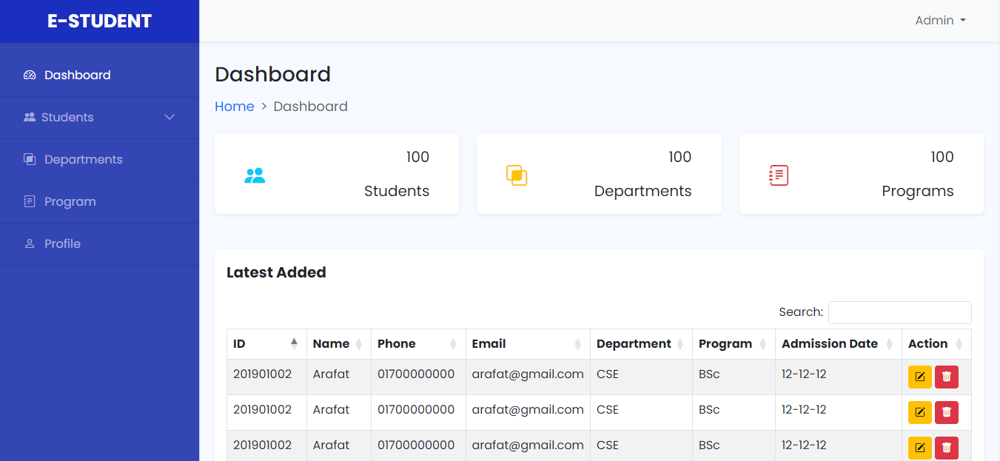
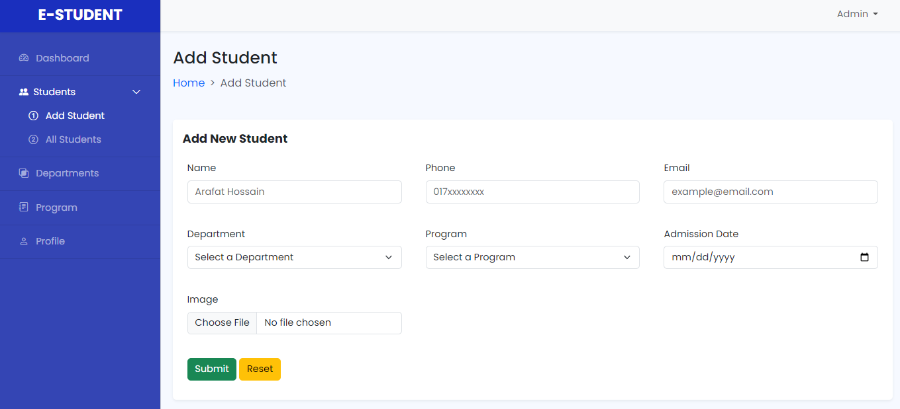
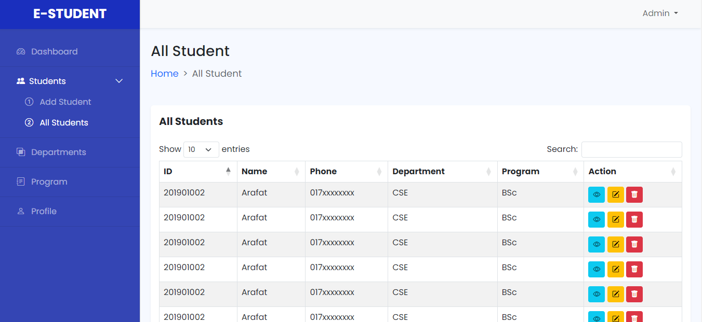
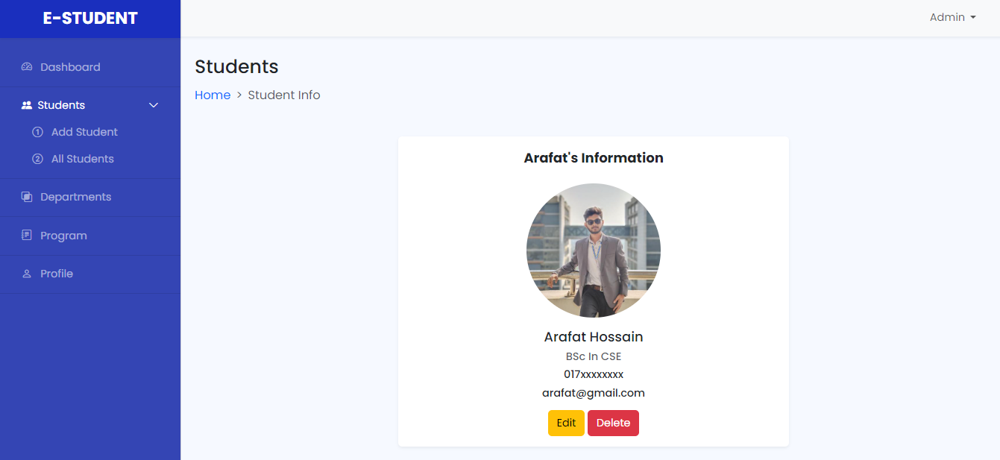
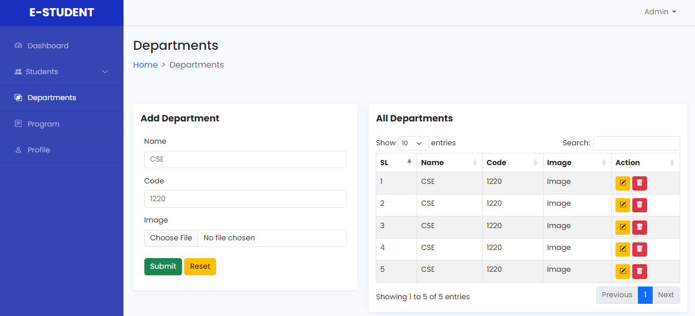
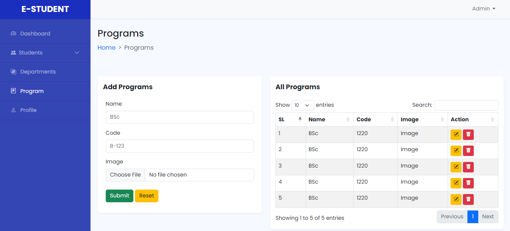
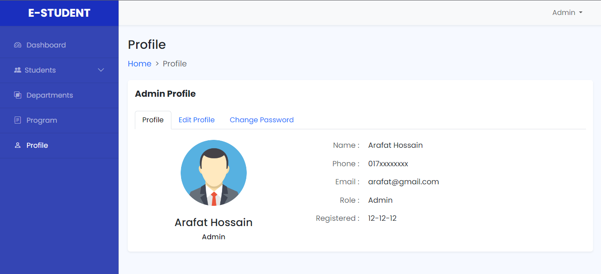

# Simple-Admin-Dashboard
Simple Admin Dashboard using Bootstrap 5

 

# Getting started

## Dashboard

## Add Student

## All Student

## Show Student

## Departments

## Programs

## Profile

